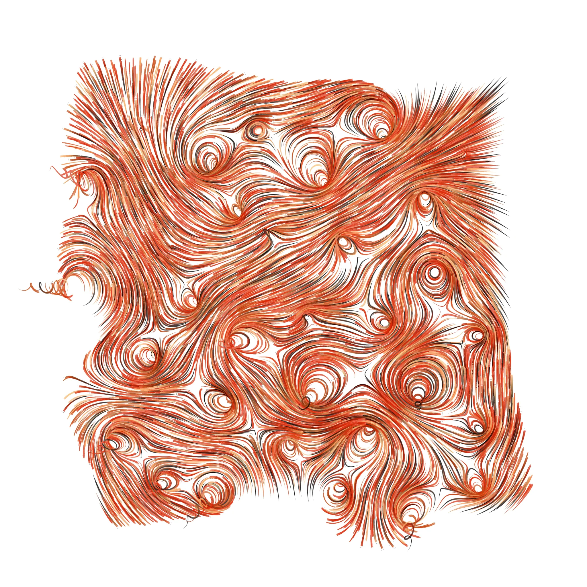
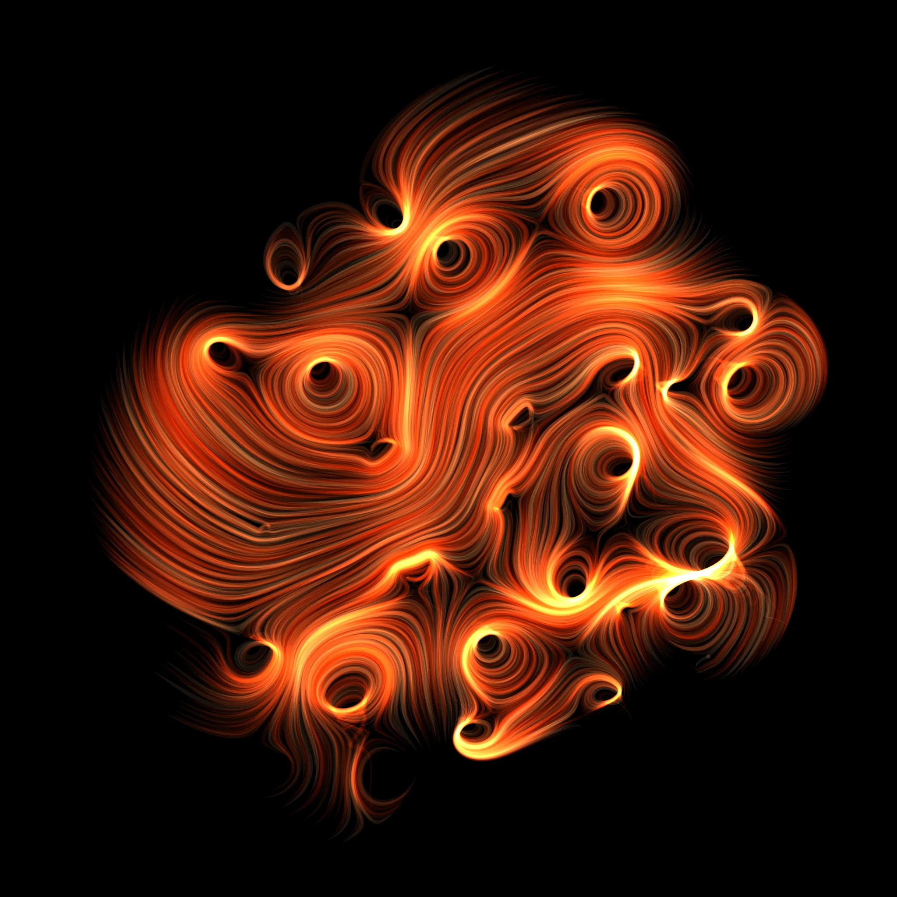

# yzho0772_9103_tut2
## Quiz 8

### Part 1: Imaging Technique Inspiration
I am inspired by generative art that uses flow fields to create moving lines. In this artwork, particles follow a vector field and form smooth, swirling patterns. By changing colour and brush-like textures, the lines can look like wind moving through a field of grass or like burning flames, which creates a strong sense of motion.

This technique is very useful for the final project. It creates visual effects based on the positions of particles, which makes it easy to use Perlin noise and random values. The movement can change over time, so it supports time-based animation. It also has strong potential for user interaction. For example, moving the mouse can change the direction of the flow, making the artwork more dynamic and responsive.
#### Figure 1: Flow field generative art (light version with brush textures)

#### Figure 1: Flow field generative art (dark version)

### Part 2: Coding Technique Exploration

This coding technique uses R to create a flow field. It first creates a vector field, and then adds streamlines inside it.This helps achieve the visual effect in Part 1 because the technique can create a vector field and generate inward spiral flows. It uses a rational function to define the spatial relationships in the field. By carefully choosing the positions of zeros and poles, the flow becomes more structured and balanced, instead of chaotic, which creates a clearer and more organised visual aesthetic.
#### Figure 3: Flow field generated using rational functions with zeros and poles

[ Link to example code](https://georgemsavva.github.io/creativecoding/posts/flowfields/)
